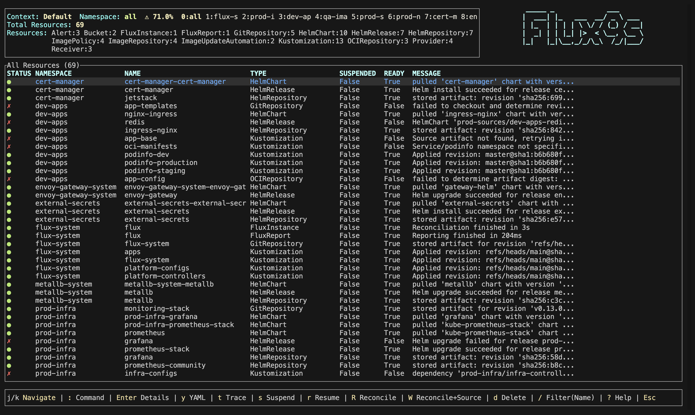
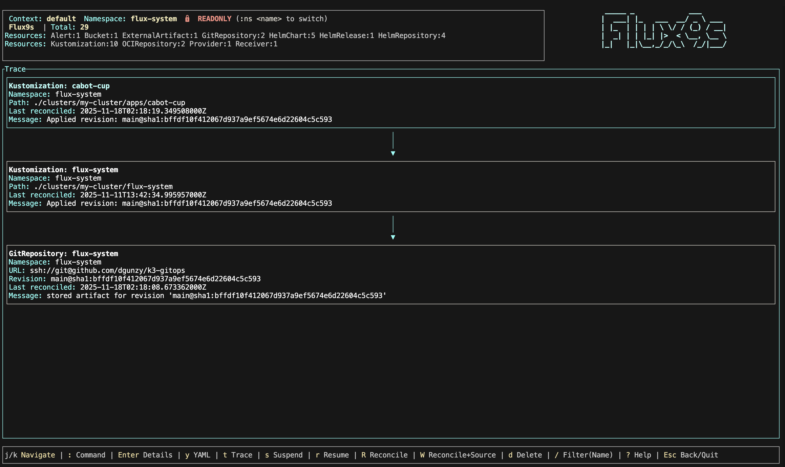
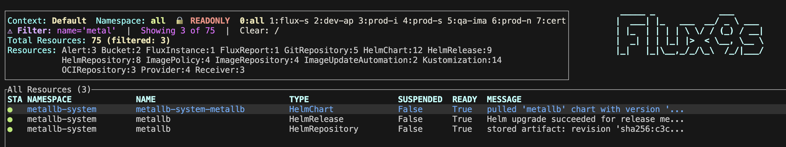

# flux9s

A [K9s](https://github.com/derailed/k9s)-inspired terminal UI for monitoring Flux GitOps resources in real-time.


### Full View

### Flux9s Trace Implementation 

### Flux9s Name filter



## Overview

`flux9s` provides a terminal-based interface for monitoring and managing Flux CD resources, inspired by the excellent [K9s](https://github.com/derailed/k9s) project. It offers real-time monitoring of Flux Custom Resources (CRDs) including Kustomizations, GitRepositories, HelmReleases, and more.

### Features

- **Real-time monitoring** - Watch Flux resources as they change using Kubernetes Watch API
- **K9s-inspired interface** - Familiar navigation and keybindings for K9s users
- **Unified and type-specific views** - View all resources together or filter by type
- **Resource operations** - Suspend, resume, reconcile, and delete Flux resources
- **YAML viewing** - Inspect full resource manifests
- **Namespace switching** - Monitor resources across namespaces or cluster-wide
- **Status indicators** - Visual indicators for resource health and suspension state

## Installation

### Homebrew (macOS and Linux)

The easiest way to install on macOS and Linux:

```bash
brew install dgunzy/tap/flux9s
```

Or tap the repository first:

```bash
brew tap dgunzy/tap
brew install flux9s
```

### Pre-built Binaries

#### cargo-binstall

If you have [cargo-binstall](https://github.com/cargo-bins/cargo-binstall) installed:

```bash
cargo binstall flux9s
```

This downloads and installs pre-built binaries without compiling from source.

#### Manual Download

Download pre-built binaries from the [Releases](https://github.com/dgunzy/flux9s/releases) page:

- **Linux (x86_64)**: `flux9s-linux-x86_64.tar.gz`
- **macOS (Intel)**: `flux9s-macos-x86_64.tar.gz`
- **macOS (Apple Silicon)**: `flux9s-macos-aarch64.tar.gz`
- **Windows (x86_64)**: `flux9s-windows-x86_64.zip`

Extract and move the binary to a directory in your `PATH`.

### Compile from Source

#### From Crates.io

```bash
cargo install flux9s
```

#### From Source Repository

```bash
git clone https://github.com/dgunzy/flux9s.git
cd flux9s
cargo build --release
```

The binary will be available at `target/release/flux9s`.

## Quick Start

1. Ensure you have a Kubernetes cluster with Flux installed
2. Configure your `kubeconfig` to point to your cluster
3. Run `flux9s`

```bash
flux9s
```

By default, `flux9s` watches the `flux-system` namespace. Use `:ns all` to view all namespaces or `:ns <namespace>` to switch to a specific namespace.

> **Note:** `flux9s` launches in readonly mode by default.  
> You can change this with `flux9s config set readOnly false` or toggle it in a session using `:readonly`.

## Usage

### Navigation

- `j` / `k` - Navigate up/down
- `Enter` - View resource details
- `y` - View resource YAML
- `Esc` - Go back / Quit
- `/` - Filter resources by name
- `:` - Command mode (e.g., `:kustomization`, `:gitrepository`)

### Commands

- `:ns <namespace>` - Switch namespace
- `:ns all` - View all namespaces
- `:skin {skin-name}` - set skin (Must be in your systems flux9s/skins dir)
- `:q` or `:q!` - Quit
- `:help` - Show help

### Operations

- `s` - Suspend resource
- `r` - Resume resource
- `R` - Reconcile resource
- `d` - Delete resource (with confirmation)

### Terminal Commands

- `flux9s config --help` - Show the config options
- `flux9s config set {KEY} {VALUE}` - set a yaml option with the cli.
- `flux9s config set ui.skin {skinname}` - set a skin that is in your systems flux9s/skins.

> **Note:** Not all K9s skins are compatible with flux9s. flux9s skins follow a similar format but may require adjustments to work properly.

## Acknowledgments

This project is inspired by and built with the following excellent tools:

- **[K9s](https://github.com/derailed/k9s)** - The terminal UI for Kubernetes that inspired this project
- **[Flux](https://github.com/fluxcd/flux2)** - The open and extensible continuous delivery solution for Kubernetes. Powered by GitOps Toolkit. 
- **[kube-rs](https://github.com/kube-rs/kube)** - The Rust Kubernetes client library powering the Kubernetes API interactions
- **[kopium](https://github.com/kube-rs/kopium)** - The tool used to generate Rust types from Kubernetes CRDs

## AI Note

AI was used to get the scaffold of this project together, if there are mistakes or
issues please open an issue, or a PR!

## Contributing

Contributions are welcome! Please feel free to submit a Pull Request.

## License

This project is licensed under the Apache License, Version 2.0 - see the [LICENSE](LICENSE) file for details.
